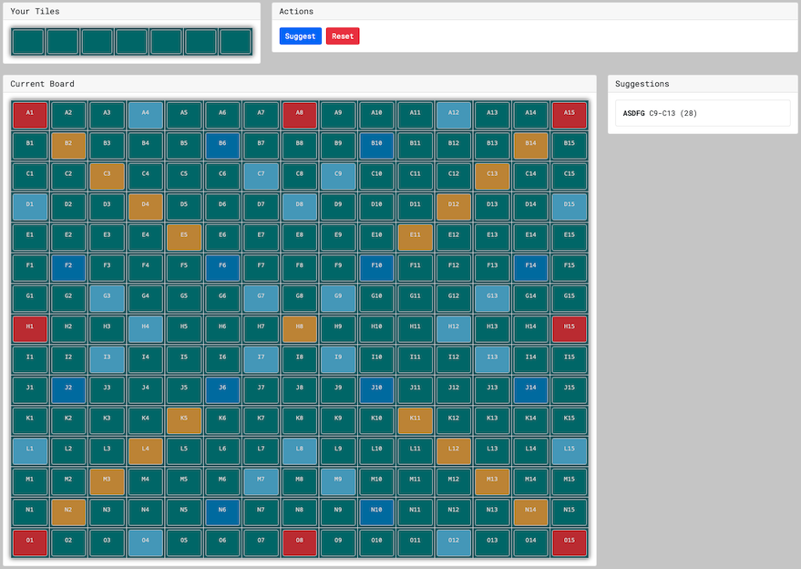

# [Kata](https://github.com/dbtedman/kata) // [Scrabbled](https://github.com/dbtedman/kata-scrabbled)

> ⚠️ WARNING: Not production ready code.

[](https://github.com/dbtedman/kata-scrabbled/actions?workflow=ci)

A solving program that suggests words using your current letters and the layout of the board.



-   [Getting Started](#getting-started)
-   [Design](#design)
-   [Attribution](#attribution)
-   [License](#license)

## Getting Started

```shell
nvm use && make && ./scrabbled
```

Visit [http://localhost:8080](http://localhost:8080)

## Design

> 🚧 Placeholder

## Attribution

### Words List

`./support/words.txt` accessed from [github.com/dwyl/english-words](https://github.com/dwyl/english-words), accessed
under [public domain](https://github.com/dwyl/english-words/blob/master/LICENSE.md).

## License

The [MIT License](./LICENSE.md) is used by this project.
